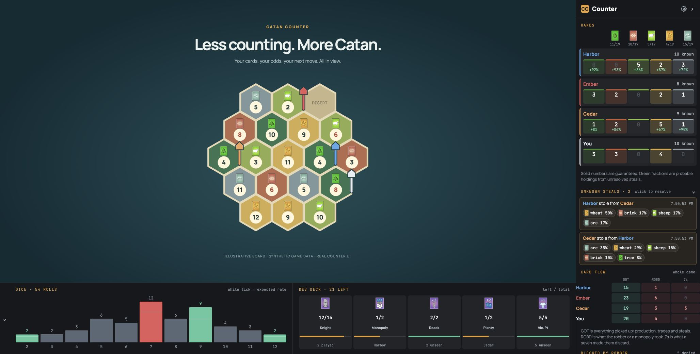

# Catan Counter

### Less counting. More Catan.

A live companion for [Colonist](https://colonist.io): follow resources, untangle steals, and see how the dice are landing.

**[Install the extension](docs/getting-started.md#installation)** · **[User guide](docs/getting-started.md#using-the-counter)** · **[Documentation](docs/README.md)**

Real extension UI with synthetic players and an illustrative demo board. No live game data.

## Keep the whole game in view

- **Read the table.** See guaranteed resources and probable holdings for every player, with the bank alongside them.
- **Make sense of steals.** Track unknown transfers, resolve a resource when you learn it, and undo a resolution if you need to.
- **See the numbers.** Compare dice rolls with their expected frequency, follow development cards played, and spot production blocked by the robber.
- **Follow the card flow.** See who is collecting cards, losing them to steals, or discarding on sevens.

## Your board. Your layout.

Put sections in the left, right, top, or bottom gutter. Resize, reorder, or hide them from settings—and collapse each gutter independently. Keep unknown steals tucked away until you need them.

Prefer a floating panel? Switch to **Overlay** from the extension popup. Layout changes apply live and your preferences are saved.

## Get playing

[Install in Chrome](docs/getting-started.md#installation), open a game on Colonist, and let the counter follow the action. Tracking begins with the first dice roll; if automatic player identification needs help, select your name when prompted.

The counter works locally in your browser. Game logs and replay captures are stored locally; exports can contain identifying information, so review them before sharing. [Data and exports →](docs/data-and-exports.md)

## Go deeper

|                                                      |                                                               |
| :--------------------------------------------------- | :------------------------------------------------------------ |
| [Installation & user guide](docs/getting-started.md) | Set up the extension, arrange your layout, and troubleshoot.  |
| [Local development](docs/development.md)             | Build, test, preview, and contribute.                         |
| [How tracking works](docs/tracking.md)               | Known cards, probabilities, steals, and the card-flow ledger. |
| [Architecture](docs/architecture.md)                 | Find your way around the code and design notes.               |

---

Independent project; not affiliated with Colonist or CATAN. Chrome is the primary target. License: ISC ([package.json](package.json)).
